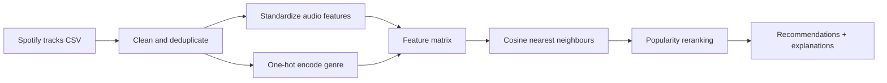

# Spotify Music Recommender 🎧

[](https://github.com/amkumirab/spotify-music-recommender/actions/workflows/ci.yml)
[](https://www.python.org/)
[](https://streamlit.io/)
[](LICENSE)

A portfolio-ready, content-based music recommendation system trained on 114K
Spotify tracks. Pick a song and the app finds tracks with a similar musical
profile using audio features, genre information, and cosine similarity.

> This is an educational project. It is not affiliated with or endorsed by Spotify.

## Highlights

- Content-based recommendation with explainable results
- Nine audio signals: energy, valence, danceability, tempo, acousticness, and more
- Optional popularity reranking and same-genre filtering
- Fast interactive Streamlit interface with Spotify deep links
- Reproducible public Kaggle dataset download
- Unit tests, linting, coverage, and GitHub Actions CI
- Full dataset fallback to a small repository sample

## How it works



The recommender is deliberately content-based: it does not require user history.
This makes the system useful for new users and new tracks, while keeping every
recommendation explainable.

## Run locally

Clone the repository and enter the project directory:

```bash
git clone https://github.com/amkumirab/spotify-music-recommender.git
cd spotify-music-recommender
```

Create a virtual environment:

```bash
python -m venv .venv
```

Activate the environment on Windows:

```powershell
.\.venv\Scripts\Activate.ps1
```

Install the project and development tools:

```bash
python -m pip install -e ".[dev]"
```

The repository includes a balanced sample covering all 114 genres, so the app
can run immediately. To download the complete Kaggle dataset, optionally run:

```bash
python scripts/download_data.py
```

Start the application:

```bash
python -m streamlit run app.py
```

Open `http://localhost:8501`, search for a track or artist, choose a seed track,
and generate recommendations. Downloading the complete dataset gives the best
results; otherwise the app automatically uses the repository sample.

## Dataset

The project uses the
[Spotify Tracks Dataset | Audio Features](https://www.kaggle.com/datasets/saichaitanyareddyai/spotify-tracks-dataset-audio-features)
from Kaggle. It contains roughly 114K tracks from 114 genres and is listed as CC0.
See [`data/DATASET.md`](data/DATASET.md) for attribution and reproducibility details.

The raw data is not committed to Git. The download script calls Kaggle's public
dataset endpoint and extracts the archive into `data/raw/`.

## Project structure

```text
spotify-music-recommender/
├── .github/workflows/ci.yml
├── data/
│   ├── raw/                    # full Kaggle data (gitignored)
│   ├── sample/                 # small reproducible demo data
│   └── DATASET.md
├── scripts/download_data.py
├── src/spotify_recommender/
│   ├── data.py                 # validation, cleaning, search
│   └── model.py                # features, similarity, ranking
├── tests/
├── app.py
└── pyproject.toml
```

## Development

```bash
python -m ruff check .
python -m pytest --cov=spotify_recommender --cov-report=term-missing
```

The GitHub Actions workflow runs the same lint and test checks on every push and
pull request.

## Roadmap

- Combine several seed tracks into a playlist profile
- Add offline evaluation with Precision@K and diversity metrics
- Learn feature weights from likes/dislikes
- Add Spotify OAuth for playlist export
- Package the model behind a FastAPI service

## License

Project code is released under the MIT License. Dataset licensing is documented
separately in [`data/DATASET.md`](data/DATASET.md).
